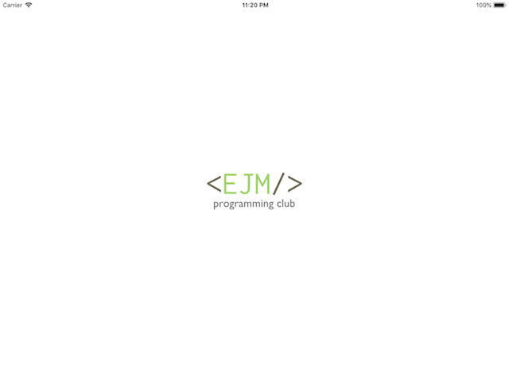
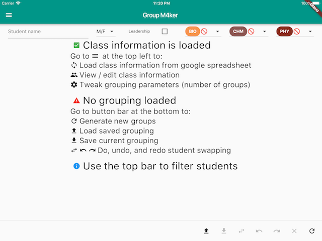
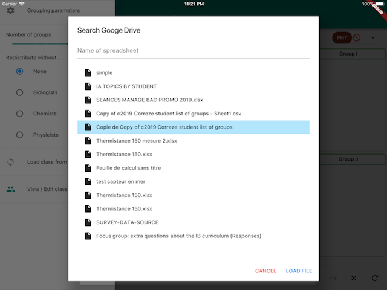
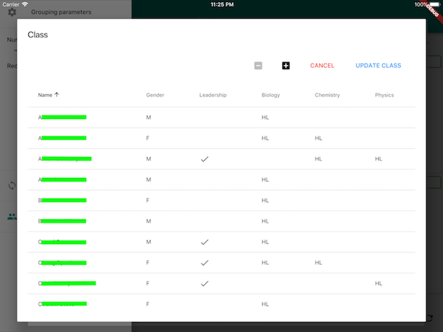
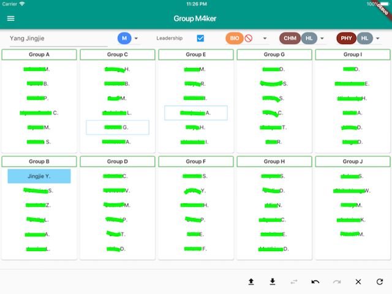

    
     
    

# Group M4ker
Group maker for IB's Group 4 field trips.

    
    

    
    

    
    

## Architecture
- 
- 

## Documentation
The code of the app is separated into `backend/` and `frontend/`,
where the former is responsible for the representation and generation of data
and the latter takes charge the user interface.

### Backend
> `backend/utils.dart`

A student's `Profile` keeps track of the student's
- gender: `Gender.M` | `Gender.F`
- leadership: `true` | `false`
- **bio**logy level: `null` (if this subject is not taken) | `Level.SL` | `Level.HL`
- **ch**e**m**istry level: `null` | `Level.SL` | `Level.HL`
- **phy**sics level: `null` | `Level.SL` | `Level.HL`

A `Student` is defined by his/her `String` name and `Profile` profile.

The list of all `Student`s is represented by a `Promo`
(as in **promo**tion, French for class;
 used instead of 'class' to avoid confusion with OOP).
`Promo` can be converted into and from csv files.

A `Promo` can be divided into `Group`s of `Student`s.
Such `Group`s form a `Grouping`.

> `backend/generator.dart`  
> `backend/generators/`

A `Generator` generates `Grouping`s.

A specific implementation of the `Generator` interface is `MinJealousyGenerator`,
which generates `Grouping`s on the basis of the minimisation of the differences (jealousy) between `Group`s.
 
> `backend/evaluator.dart`  
> `backend/evaluators/`

An `Evaluator` evaluates the quality of the `Grouping`s in terms of its issues.

A specific implementation of the `Evaluator` interface is the `MeanEvaluator`,
which evaluates `Grouping`s asserting that, for instance, the number of 
females, SLs and physicists do not deviate from the mean values.

### Frontend
- The global app state is managed within `Grouper`.
- The rendering of the groups and students are implemented in `GroupBox` and `StudentEntry`.
-  
